# RAG Benchmark System

<p align="center">
  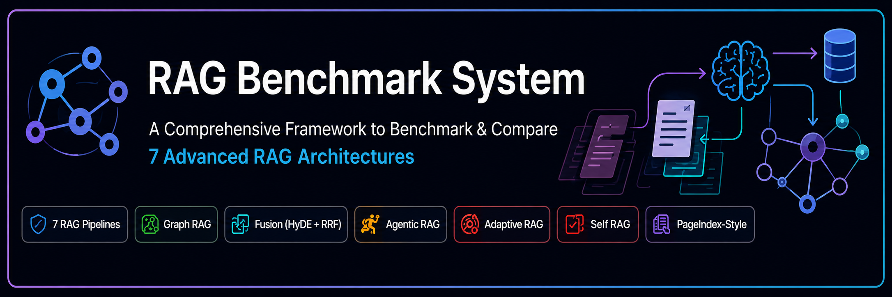
</p>

Hi everyone, I'm Amrish Puri Goswami!

When building RAG systems, choosing the right architecture can be tough. That’s why I built this project: a standardized benchmark framework to evaluate and compare different Retrieval-Augmented Generation architectures side-by-side using identical documents, query sets, and evaluation pipelines.

In this repository, I’ve implemented and benchmarked seven different approaches:

- Simple RAG
- Fusion RAG
- Self RAG
- Adaptive RAG
- Agentic RAG
- Graph RAG
- Multimodal RAG / PageIndex-style retrieval

The goal is to study how each architecture behaves under different question types, retrieval limitations, context quality, and answer-generation quality.

---

## Overview
<p align="center">
  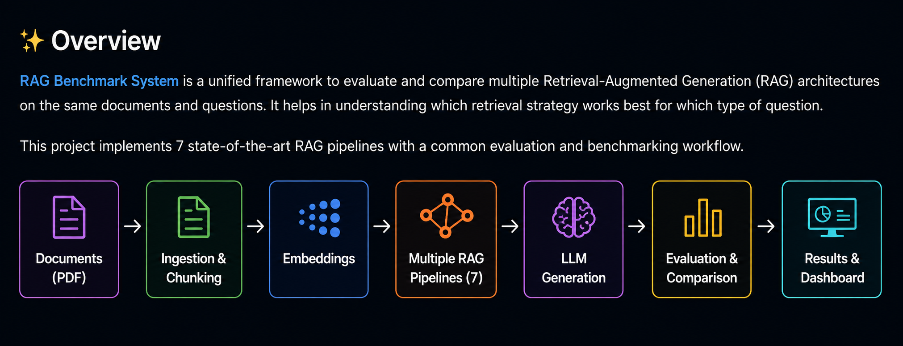
</p>
This project is built to benchmark how different retrieval strategies perform on enterprise-style documents such as:

- HR policy documents
- employee stories and performance reviews
- customer satisfaction reports
- asset registers
- board meeting notes
- CloudServe vendor reports and policy material

The benchmark uses a central vector database, LLM-based generation, and modular RAG pipeline implementations to compare outputs side-by-side on the same query set.

---

## Key Highlights

- Multi-RAG benchmarking in one project
- Modular architecture for reuse and extension
- Real PDF ingestion and chunking pipeline
- Vector retrieval with ChromaDB
- Graph RAG support using Neo4j-style graph construction and retrieval
- Multimodal/PageIndex-aware retrieval workflow
- Centralized configuration and model selection
- Terminal-driven and script-driven evaluation workflow
<p align="center">
  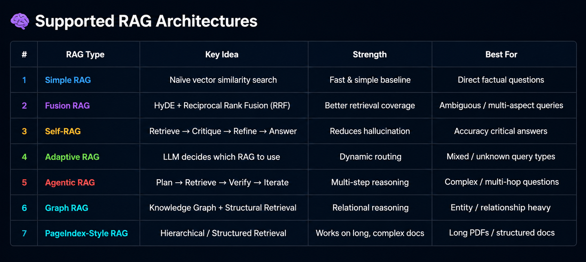
</p>
---

## Repository Structure

```text
RAG-Benchmark-System/
├── app.py                          # Main interactive entry point
├── benchmark.py                   # Benchmark runner and report generator
├── config.py                      # Project configuration and environment settings
├── requirements.txt               # Python dependencies
├── README.md                      # Project overview and usage guide
├── 123.txt                        # Report draft / LaTeX content
├── flow_diagram.html              # Diagram visualization
├── rag_benchmark_flow.png         # Main project image
├── data/                          # Input PDF documents and question file
├── db/                            # Vector database and Chroma storage
├── embeddings/                    # Embedding model layer
├── ingestion/                     # PDF loading and chunking utilities
├── llm/                           # LLM factory and model interfaces
├── profiles/                      # Document profile files and summaries
├── rags/                          # All RAG implementations
├── vectordb/                      # Vector database wrapper
├── outputs/                       # Benchmark outputs and reports
├── dashboard/                     # Streamlit UI or dashboard code
├── scratch/                       # Experiment and test scripts
└── tests/                         # Benchmark and validation scripts
```

---

## Main Project Modules
<p align="center">
  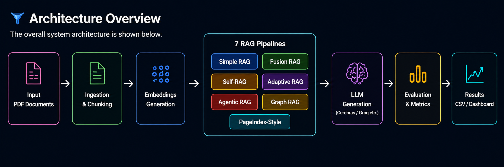
</p>
### Core application and evaluation

- [app.py](app.py) — main command-line interface for running RAG variants and building the vector database
- [benchmark.py](benchmark.py) — benchmark runner that executes the same question across multiple RAG systems and saves results
- [config.py](config.py) — project-wide settings and environment configuration
- [requirements.txt](requirements.txt) — dependencies required to run the project

### Data and ingestion

- [data](data) — PDF source documents and benchmark questions
- [ingestion](ingestion) — PDF loading and chunking logic
- [profiles](profiles) — generated profiles, summaries, and extraction prompts for document processing

### Retrieval and generation layers

- [embeddings](embeddings) — embedding generation and model loader
- [vectordb](vectordb) — Chroma vector database access and retrieval wrapper
- [llm](llm) — LLM factory logic and model clients
- [rags](rags) — all retrieval architectures and implementations

### Benchmark outputs

- [outputs](outputs) — generated benchmark results and report artifacts
- [dashboard](dashboard) — dashboard UI for inspection or analysis

---

## RAG Architectures Included
<p align="center">
  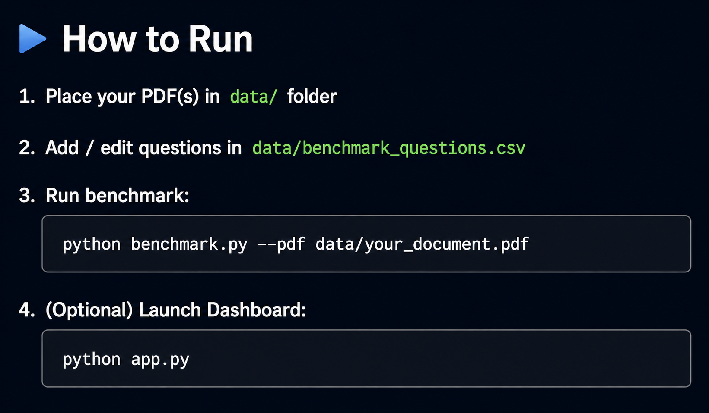
</p>
### 1. Simple RAG

The baseline approach: query the vector store, pull the nearest matching chunks, and generate an answer from the retrieved context.

### 2. Fusion RAG

Uses multiple retrieval pathways and re-ranking to combine evidence from several candidate chunks before generation.

### 3. Self RAG

Generates a draft answer, critiques it against the retrieved context, and revises it when the answer is weakly grounded.

### 4. Adaptive RAG

Routes each question to the most appropriate retrieval strategy based on its type and complexity.

### 5. Agentic RAG

Creates a plan, executes retrieval steps, verifies whether the answer is supported, and re-runs retrieval if necessary.

### 6. Graph RAG

Builds a structured knowledge graph from the documents and answers using graph facts and relationship paths.

### 7. Multimodal RAG / PageIndex

Combines text, section structure, and multimodal information for more context-aware execution over more complex documents.
<p align="center">
  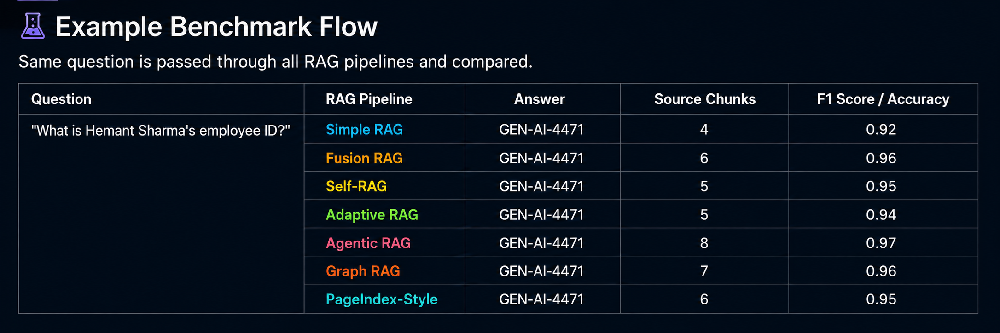
</p>
---

## Example Workflow

```python
from rags.simple_rag.simple_rag import SimpleRAG
from rags.fusion_rag.fusion_rag import FusionRAG

simple = SimpleRAG()
fusion = FusionRAG()

question = "What is Hemant Sharma's employee ID?"

simple_result = simple.ask(question)
fusion_result = fusion.ask(question)

print(simple_result["answer"])
print(fusion_result["answer"])
```
<p align="center">
  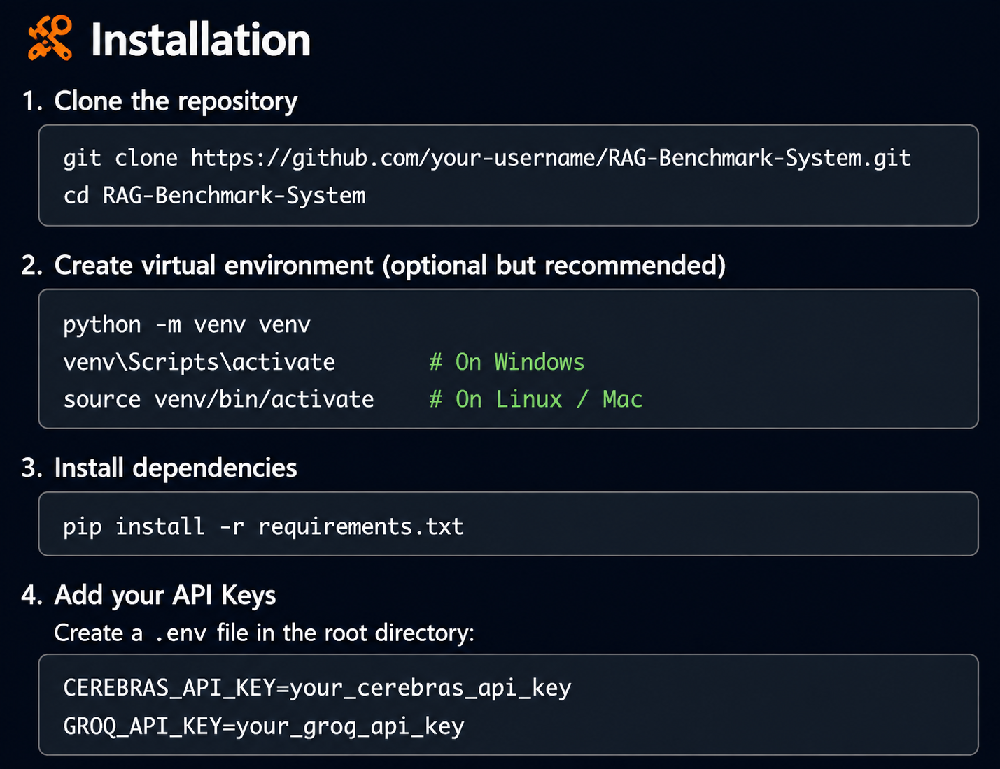
</p>
This demonstrates the benchmarking pattern used by the repository: run the same question through multiple RAG pipelines and compare the quality of retrieval, context, and final answer.

---

## Project Images

<p align="center">
  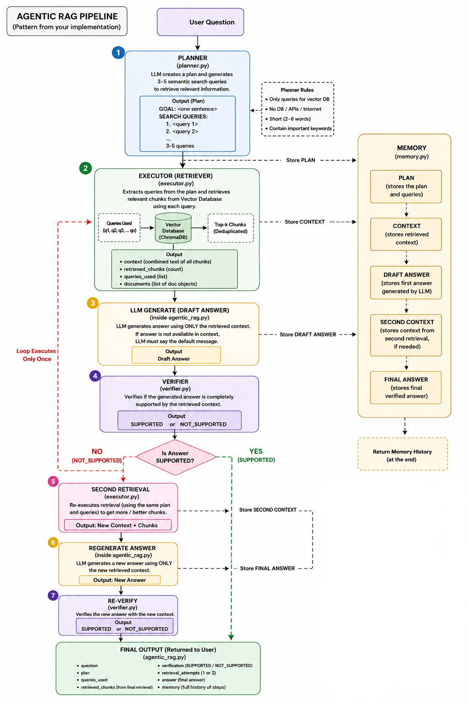
  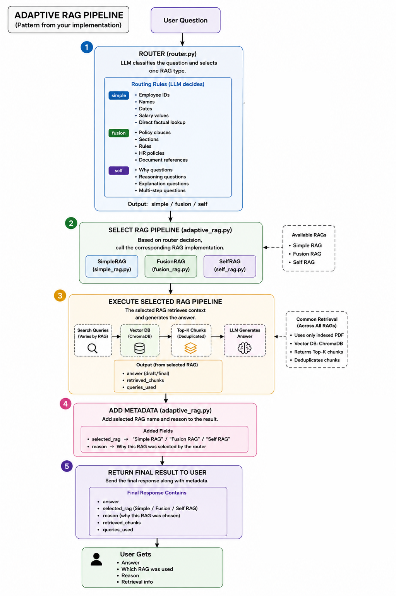
</p>

<p align="center">
  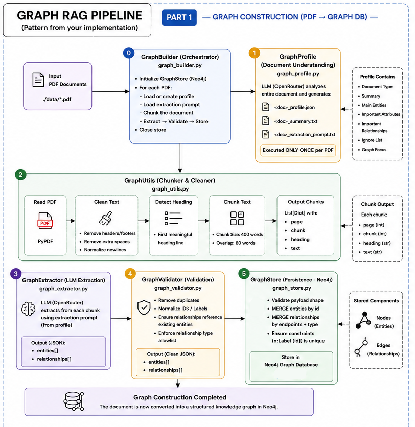
  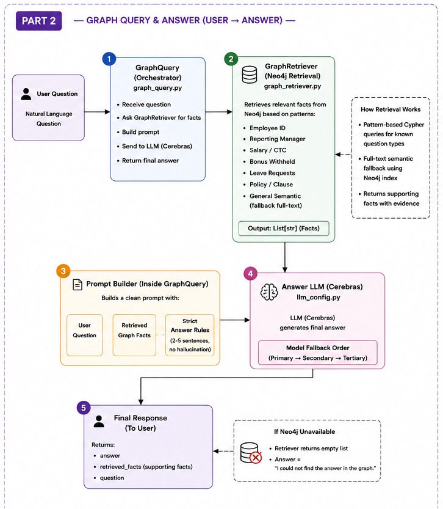
</p>

These visual assets illustrate the overall architecture, retrieval flow, and benchmarking structure used in this repository.

---

## Benchmarking Philosophy

The project focuses on showing that not every query is suitable for every retrieval strategy:

- simple factual queries may work well with baseline vector retrieval
- ambiguous or multi-step questions may fail or return weak answers in Simple RAG
- stronger systems improve performance by using query expansion, validation, plans, routing, graph structure, or multimodal context

This is the core idea behind the repository: compare retrieval quality and answer reliability across multiple RAG patterns, not just one pipeline.

---

## Documentation and Reports

The project also includes technical report materials in the root workspace, such as:

- [123.txt](123.txt) — technical report draft and documentation
- [flow_diagram.html](flow_diagram.html) — HTML flow diagram view
- [outputs](outputs) — results and benchmark outputs
<p align="center">
  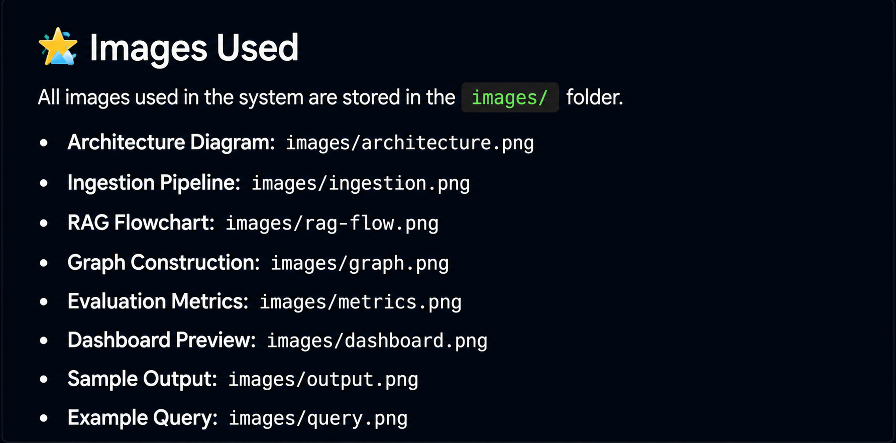
</p>
---

# ⭐ Support Us
<p align="center">
  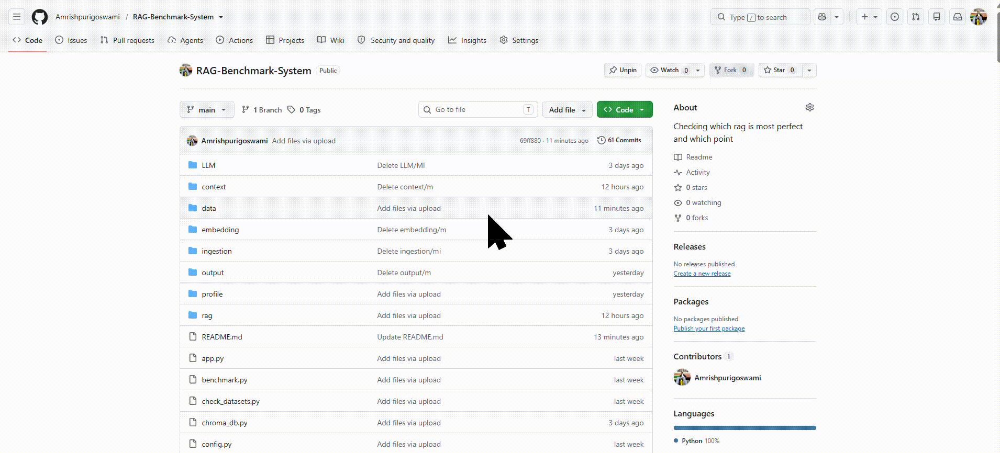
</p>
Leave us a star 🌟 if you like our project. Thank you! 

### Connect with Me

<div align="center">

[](mailto:amrishpurigoswami4@gmail.com)&nbsp;
[](https://www.linkedin.com/in/amrish-puri-goswami-145b7927a/)&nbsp;
[](https://github.com/Amrishpurigoswami/RAG-Benchmark-System)&nbsp;

</div>

---
## License

This repository is intended for academic and project demonstration use in benchmarking and research on retrieval-augmented generation systems.

---

<p align="center">
  <sub>Built for comparative RAG analysis, retrieval benchmarking, and document-grounded generation workflows.</sub>
</p>
